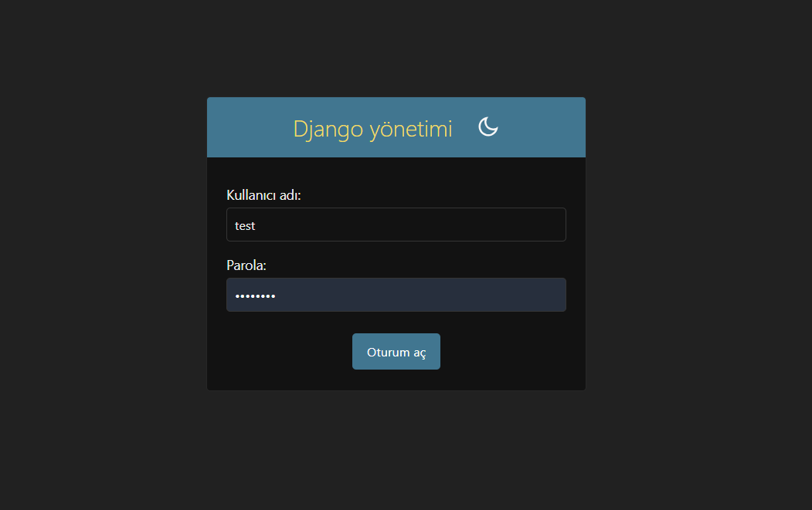
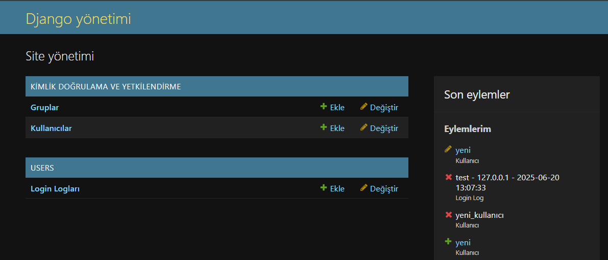
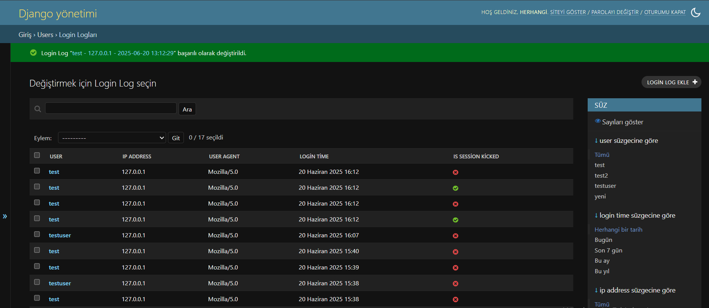
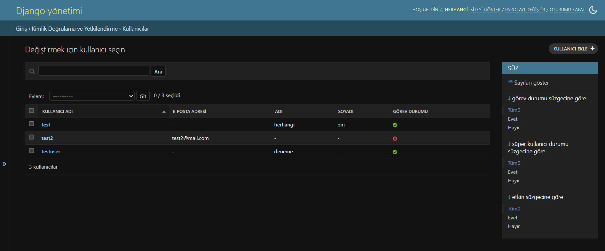
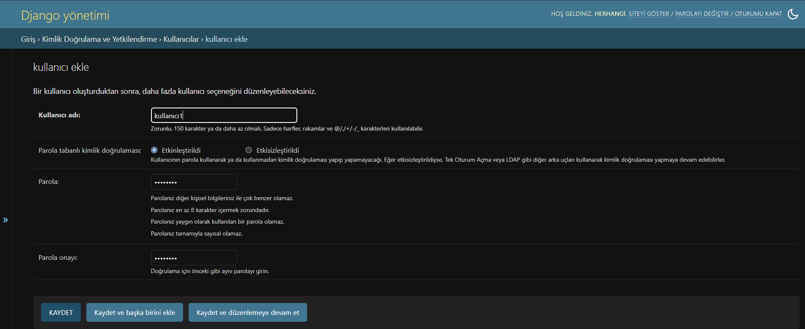

# 🔐Tek Oturum Takip Sistemi

Django tabanlı, bir kullanıcının aynı anda sadece tek cihazdan giriş yapabilmesini sağlayan ve tüm girişlerin IP, User-Agent gibi bilgilerle loglandığı sistem.

## 🎯Projenin Amacı

- ✅ Aynı anda yalnızca tek cihazdan giriş yapılabilmesini sağlamak  
- 🔁 Yeni cihazdan giriş yapıldığında eski oturumu kapatmak  
- 🗂️ IP, User-Agent, zaman bilgileriyle log tutmak  
- 📊 Admin panelde bu verileri filtreleyebilmek

## 🛠️ Kullanılan Teknolojiler

- 🐍 Python 3.13.1  
- 🌐 Django 5.2.3  
- 📡 Django Signals  
- 🔐 Django Sessions  
- ⚙️ Django Admin Panel  
- 🗃️ SQLite (Geliştirme için)

## ⚙️ Kurulum

1. 📁 Proje dosyalarını yerel bilgisayarınıza indirin veya kopyalayın.  
2. 💻 Proje klasörüne gidin:  
   `cd proje_klasoru`  
3. 🌱 Sanal ortam oluşturun ve aktif edin:  
   `python -m venv env`  
   `env\Scripts\activate` (Windows) veya `source env/bin/activate` (Linux/macOS)  
4. 📦 Gerekli kütüphaneleri yükleyin.
5. 🧱 Veritabanı migrasyonlarını uygulayın:  
   `python manage.py migrate`  
6. 👤 Süper kullanıcı oluşturun (opsiyonel):  
   `python manage.py createsuperuser`  
7. 🚀 Sunucuyu başlatın:  
   `python manage.py runserver`

📝 Kullanım

- 👤 Sisteme bir kullanıcı hesabıyla giriş yapın.  
- 📲 Aynı kullanıcı ile başka bir cihazdan giriş yapmaya çalıştığınızda, önceki oturum otomatik kapatılır.
- 📊 Admin panelde tüm giriş loglarını tarih, IP ve kullanıcıya göre filtreleyebilirsiniz.

## 🗂️ Proje Yapısı

```
tek_oturum_projesi/
│
├── tek_oturum_projesi/ # Django ayarları ve URL’ler
│
├── users/ # Oturum yönetimi ve loglama
│ ├── signals.py # user_logged_in sinyali
│ ├── models.py # LoginLog modeli
│ └── admin.py # Logları admin panelde gösterir
```

## 📚 Öğrenilenler

- ⚡ Django sinyalleri ile olay takibi  
- 🔐 Session yönetimi ve oturum sonlandırma  
- 🧩 Özel model ve admin panel özelleştirme  
- 🌍 IP ve User-Agent bilgisi alma  
- 📊 Admin panel filtreleri ve istatistik çıkarmaya giriş

## 🖼️ Ekran Görüntüleri

### 🧑‍💻️ Giriş Sayfası


### 🛠️ Admin Paneli


### 📋 Log Kayıtları


### 👥 Kullanıcılar Listesi


### ➕ Kullanıcı Oluşturma


## 🔗 Kaynaklar
- PROTOTURK (Youtube) - Python Dersleri
- Barış Aslan (Youtube) - Django ile Web Programlama
- Hakan Çelik - Django Signals
- Egehan Gündoğdu - Django Signals
- Signals (Django Protect) - Djagno Documentation
- Born To Code (Youtube) - Understanding Django Signals
- Memedi Khan (Medium) - Step-by-Step to Djagno Signals
- Corey Schafer (Youtube) - Python Djagno Tutorial
- Sessions (Django Protect) - Djagno Documentation

## 🧱 Güncellemeler
- Logout Log’u eklendi
- Giriş Başarısız Log’u eklendi


> 📌 Eğer bu projeyi beğendiysen ⭐ vererek destek olabilirsin!